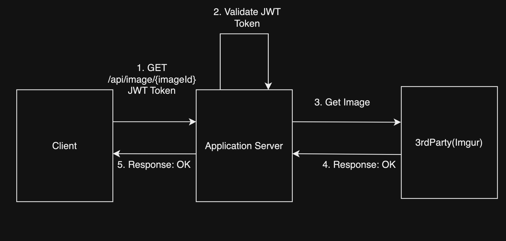
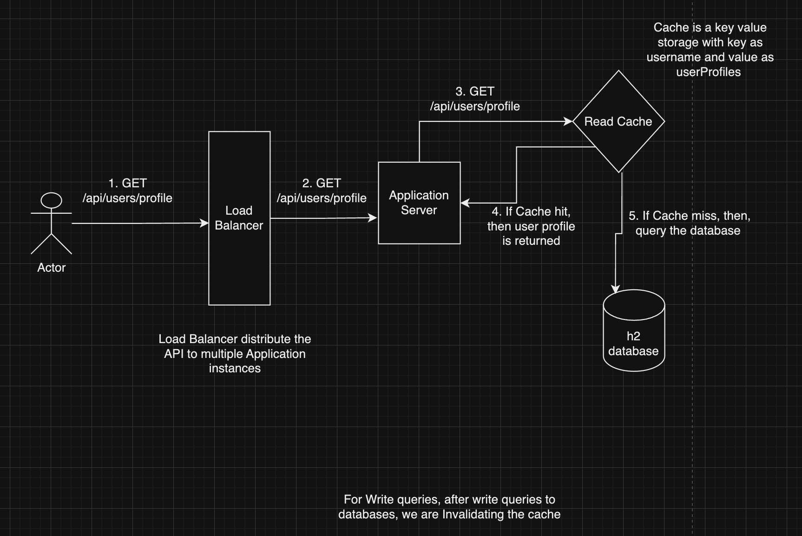

## Table of Contents
- [SpringBootApplication](#SpringBootApplication)
- [Functional Requirements](#functional-requirements) 
- [NonFunctional Requirements](#nonfunctional-requirements)
- [Bonus Points](#Bonus-Points)
- [Database Schema](#database-schema)
- [API Endpoints](#api-endpoints)
- [Points to consider](#points-to-consider)
- [High Level System Design](#high-level-system-design)
- [Low Level System Design](#low-level-system-design)
- [Bonus Point Discussion](#bonus-points-discussion)
# SpringBootApplication

Introducing SynchronyImgurRESTApp, a REST Application for allow users to register, authenticate, and manage images. 
This project is designed and developed in order to integrate with Imgur API to upload, view, and delete images while associating them with the user profile.

## Functional Requirements
-  Register users with basic information, including a username and password.
-  After user authentication, allow image upload, viewing, and deletion.
-  Each user can have an associated list of images.
-  User authentication will be managed using a username and password stored in an in-memory H2 database.
-  The application should log important events and errors.
-  JUnit test cases must be implemented.

## NonFunctional Requirements
-  Spring Boot 3.x.x framework
-  JDK 17 or lower
-  H2 Database (in-memory for storing user information)
-  Imgur API Integration for image operations
-  Security
-  Scalable

## Bonus Points
-  Secure API via oAuth2
-  Optimize API for 100K RPM
-  Establish CI/CD Pipeline (feel free to use open-source tools)
-  Create a messaging event that publishes the username and the image name to a Messaging Platform (Ex: Kafka)
    & feel free to connect with a local or cloud instance of the Messaging Platform.
-  Preferably following the TDD approach for Junit test cases

## Database Schema
-  We are using H2(In Memory Database) as given in the requirement
-  There are two relational tables which are as follows:
    -  User
        -  id: Generated ID
        -  username: Unique Parameter
        -  password: Storing password in encrypted form with the help of Bcrypt
        -  email: Unique Parameter
        -  List<Image>images: List of images and OnetoMany relations
    -  Image
        -  id: Generated ID
        -  imgurId: Id that ImgurAPI generates
        -  imgurLink: The Image link that is uploaded to Imgur
        -  imgurDeleteHash: The delete hash used to delete the image in Imgur
        -  imgurName: The name of the file that is uploaded

## API Endpoints
- User Management
    - POST /api/users/register: Registers a user with username and password and basic information.
    - GET /api/users/profile: Retrieves user basic information and image list(authenticated request)
    - POST /api/users/login: Authenticates user based on username and password
    - POST /api/users/logout: Logout the current user
- Image Management
    - POST /api/upload: Upload an image to Imgur (authenticated request)
    - GET /api/images/{imageId}:: View a specific image associated with the user (authenticated request)
    - DELETE /api/images/{imageId}: Deletes a specific image from Imgur (authenticated request)

## Points to consider
- Implemented authentication type of JWT Token storing in cookies(HttpOnly cookie), later verifying from the server(Implemenation below)
- Implemented Logger functionality. The logs are being stored at logs.

## High Level System Design

**This System is based on how a client app can handle crud activities for 3rd Party App. The flow behind the app is**
 - The user Will Register through our App and the information will be stored in the h2 database
 - User Login through our app using username and password. In exchange, our app will send the user a JWT token which will be set as a cookie on the client side.
 - Whenever a user tries to upload, get or view an image, our client sends a request with that cookie. Our server extracts the token, validates the token, and authenticates the user to perform the operations. 
 - The corresponding request for metadata of the image are also updated in our database.
 - If the Server cannot verify the token, it will declare the client as an unauthorized user.
 - If user choose to logout, the Cookie is Deleted at client side.
 - The expiry time of cookie is 1 hour.

- Registration API

-  

- Login API

-  

- Upload Image API  

-  

- Delete Image API  

-  

- Get Image API  

-  

- Get Profile API  

-  

## Low Level System Design
- Here I follow, a standard 3-layer architecture – Controller, Service, Repository) that is commonly used in SpringBoot.
- The Beans that I have covered in this project are:
-  User Controller: Exposes REST endpoints for user registration and authentication and getProfile.
-  User Service: Handles the logic for user registration, authentication, and linking images.
-  User Repository: Manages CRUD operations for the user entity.
-  Image Service: Interfaces with Imgur API to manage image-related operations.
-  Image Controller: Exposes REST endpoints for upload, view, and delete images.
-  Image Repository: Stores the image metadata associated with users.

## Bonus Points Discussion
In this section, I would like to discuss about my approach for each bonus point.   
For some points have implemented the in the project and for some point, I will like to answer the by givng the design.

### Secure API via oAuth2
-  Architecture Design
-  oAuth2 is a widely adopted authorization framework that enables third-party applications to access a user's resources or perform actions on their behalf, without requiring the user to directly share their credentials (like username and password).
-  A user wants to use a third-party application (the client) to access their protected resources stored on a different service (the resource server, in our case Imgur).
-  The client redirects the user to the authorization server (e.g., Google’s OAuth server).
-  The user logs in to the authorization server (if they are not already logged in) and is presented with a consent screen.
-  If the user approves, the authorization server sends an authorization code to the client.
-  The client sends this authorization code to the authorization server (along with its own client credentials) to request an access token. The server validates the code and, if valid, sends the client an access token (and optionally a refresh token).
-  The client can now use this access token to make authorized API calls to the resource server and access the user’s data.
-  Access tokens are typically short-lived for security reasons. If the access token expires, the client can use the refresh token (if provided) to obtain a new access token from the authorization server, without requiring the user to log in again.

-   

### Optimize API for 100K RPM
-  Architecture Design
-  Code Implemenation for Cache
-  We can acheive scalability by using <b>Load Balancer</b> Receives the 100K requests/minute and distributes them evenly to multiple application instances of our application server. Load Balance can also used for Rate Limiting factor.
-  The Database Processes queries efficiently with read replicas and optimized indexing. We index through username.
-  For caching, we have implemented using in-memory cache. In Springboot, we are using the <b>Caffeine</b> dependency.
-  For the GetProfile API(/api/users/profile). We are using the Cache in front of Database. So whenever the user hits this API. Instead of going to database this query goes to cache for accessing the data. Cache stores the most frequent data. 
-  If the cache does not have data, API hits the database for read query.
-  Cache is a key value storage with key as username and value as userProfiles.
-  Written all the logic behind cache in <b>Service</b> layer
-  For Image update and delete queries, after writing to the database we are invalidating the cache and whenever the getProfile API will be called first it will take the query from database and after that save it to read cache.
-  We are using @CacheEvict annotation in our code base which removes the cache entry for the specified key (#username) from the userProfiles cache. It ensures the cache is invalidated before the method completes. This is important because you're modifying the user's profile, and the cached version of the user profile would no longer be valid.
-  However, cache eviction occurs only after the method successfully completes, not before or during the transaction. If the database operation fails, the cache eviction is rolled back because it's part of the same transaction(Using @Transactional annotation).

-   

### Messaging Platform (Ex: Kafka)
-  Architecture Design
-  Code Implementation for Message Queue(Kafka)
-  We have to implement a message queue, so whenever an upload happens on the client side. The event is published to message queue with username and imageName whenever 
   upload of the image happens.
-  The Flow of the implementation:
    - Configure Kafka in Spring Boot: Add Kafka Dependency in pom.xml. Configure application.properties.
    - Create the Kafka Topic at application.properties. Remember we have to keep the kafka at localhost:9092.
    - Define a Messaging Service with the topic taken: Define a publish user image event.
    - Integrate with Image Upload Logic: add the publish event to the Image Upload controller.
    - Start Zookeeper, Kafka, and Kafka consumer at Localhost. Subscribe the Kafka consumer to ther topic user-image-events
    - Upload the Image, as it will upload the image. On the Kafka consumer CLI, you will see the username and image name also printed.
-  Key Takeaway: We are using @Async for the publish event function and @EnableAsync for the our Application, which make sure that this messaging event is in another thread 
   and asynchronous. So, if it fails, the Image Upload function which is a main function should not throw exception.

-   

### Preferably following the TDD approach for Junit test cases
-  Written the JUnit test Cases for both the Controller and Service Layer.
-  Define test cases for the expected functionality before writing the actual code.
-  Tests fail initially because the functionality does not exist yet
-  Write just enough code to make the failing test pass.
-  Clean up the code for quality and maintainability while ensuring all tests still pass.

### CI/CD Pipeline
-  Out of Scope
